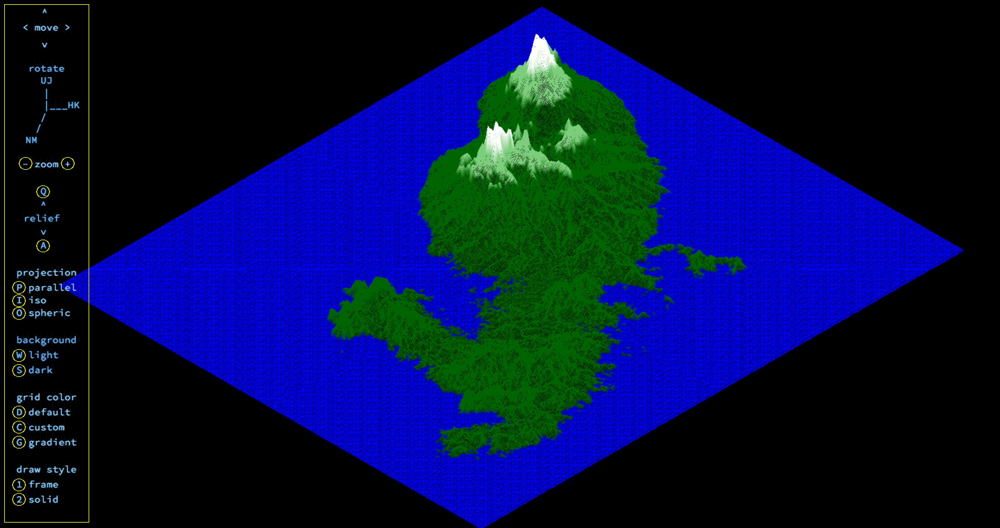

# wireframe relief


This project is about creating a simplified graphic *wireframe*  representation of a relief landscape linking various points (x, y, z) via segments using [Bresenham's algorithm](http://members.chello.at/easyfilter/bresenham.html). The coordinates of this landscape are stored in a map-file passed as a parameter to program.
```
map example

0  0  0  0  0  0  0  0  0  0  0  0  0  0  0  0  0  0  0
0  0  0  0  0  0  0  0  0  0  0  0  0  0  0  0  0  0  0
0  0 10 10  0  0 10 10  0  0  0 10 10 10 10 10  0  0  0
0  0 10 10  0  0 10 10  0  0  0  0  0  0  0 10 10  0  0
0  0 10 10  0  0 10 10  0  0  0  0  0  0  0 10 10  0  0
0  0 10 10 10 10 10 10  0  0  0  0 10 10 10 10  0  0  0
0  0  0 10 10 10 10 10  0  0  0 10 10  0  0  0  0  0  0
0  0  0  0  0  0 10 10  0  0  0 10 10  0  0  0  0  0  0
0  0  0  0  0  0 10 10  0  0  0 10 10 10 10 10 10  0  0
0  0  0  0  0  0  0  0  0  0  0  0  0  0  0  0  0  0  0
0  0  0  0  0  0  0  0  0  0  0  0  0  0  0  0  0  0  0

some maps may contain a color codes
```

You can find examples in the `maps` folder. Use ready maps or create your own using a [map-generator](https://github.com/jgigault/42MapGenerator)


There are basics of graphic programming in this project, and in particular how to place points in space, how to join them with segments and how to observe the scene from a particular viewpoint.

`miniLibX` - is a graphic library, wich was developed internally in Ecole42 and includes the minimum necessary to open a window, light a pixel and deal with events linked to this window: keyboard and mouse.

## Install

```
git clone https://github.com/gitEllE-if/wireframe_relief.git mapViewer
cd mapViewer
make
```
The program was tested and run on MacOS (Mojave, HighSierra, Catalina)


## Usage

```
./fdf map_file

example: ./fdf maps/42.fdf
```

- `[arrows]`  - move
- `[UJ HK NM]` - rotate
- `[A Q]` - flat/relief
- `[+ -]` - zoom in/out
- `[P I O]` - projection parallel/ISO/spheric
- `[D C G]` - color default/custom/gradient
- `[1 2]` - draw style frame/solid
- `[0]` - line thickness on/off
- `[W S]` - background light/dark
- `[X]` - z-buffer on/off



